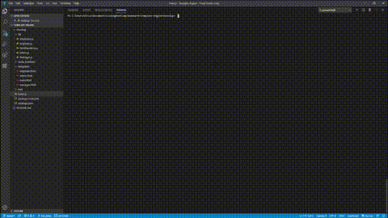

# Mangement Template Engine
This simple CLI will generate a html file visualizing the manager and employees.
## How to use
After downloading the files enter `node .index.js` in the terminal.

At the prompt Enter the user's name, the employee ID , the email address. Then it will prompt for additional information depending on their role: manager - office number; engineer - GitHub username; intern - name of their school.

When the last team member has been entered the applicaiton will generate ./output/team.html

## Demo


## Highlights
This code highlight is to generate the team.html file.
```
function createHTML (teamMembers) {
    if (!fs.existsSync(OUTPUT_DIR)) {
        fs.mkdirSync(OUTPUT_DIR);
    }
    fs.writeFile(outputPath, render(teamMembers), function (err) {
        if (err) throw err;
        console.log("File created successfully");
    })
}
```
